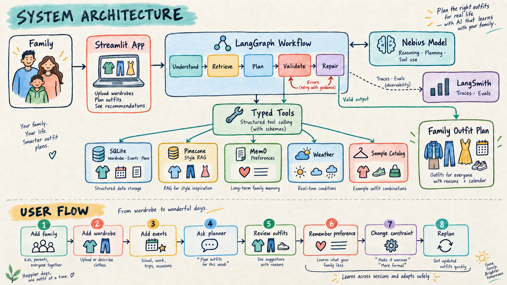
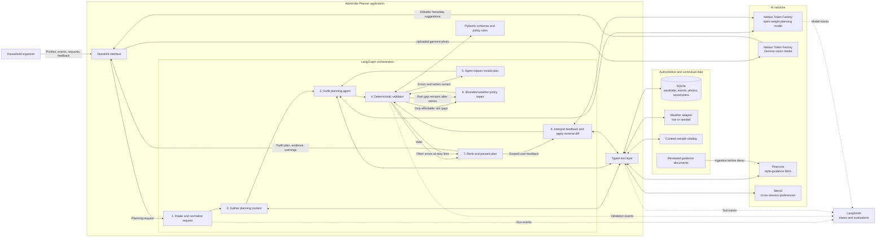
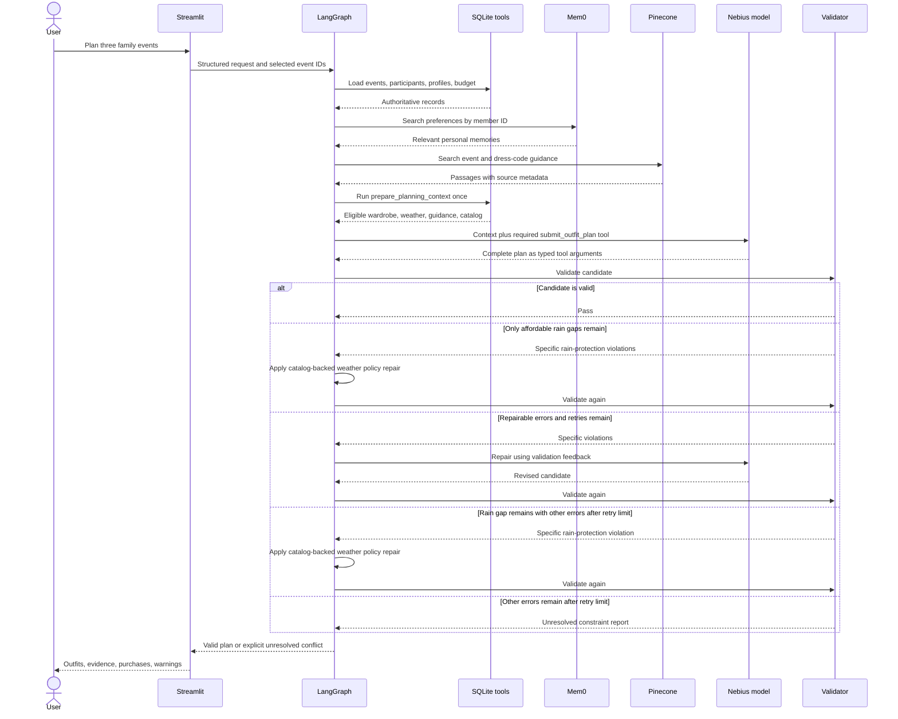
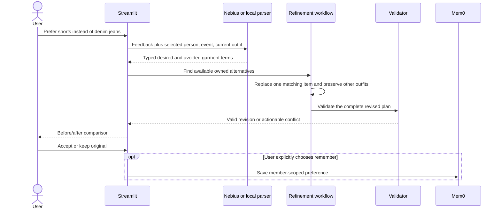
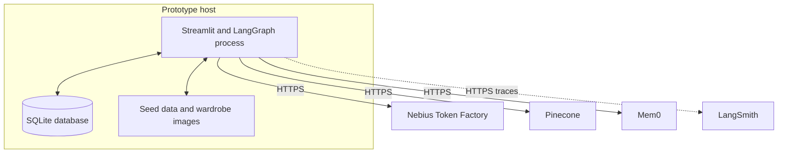

# Architecture: Family Wardrobe & Lifestyle Planner

**Version:** 0.1  
**Scope:** Single household prototype  
**Related document:** [Product Requirements Document](./PRD.md)



## System architecture



## Architectural intent

The application uses a hybrid workflow. LangGraph controls the required sequence, gathers authoritative context through the typed `prepare_planning_context` tool, validates the result, and enforces termination conditions. The Nebius model has bounded autonomy inside the planning stage: it chooses the outfit combinations, explains them, decides whether catalog purchases add value, and submits the complete result through the typed `submit_outfit_plan` tool. A live run therefore needs one provider request for each planning or repair attempt instead of one request per data lookup. When every validation failure is an affordable rain-protection gap, a narrow workflow policy adds the applicable catalog item immediately, records that action, and validates the plan again. Other errors retain the bounded model-repair loop.

The model never becomes the source of truth for inventory, availability, events, or budget.
Inventory, availability, and events come from SQLite-backed application state; household profiles,
the catalog, and default budgets are bootstrapped from versioned seed data. Typed tools expose the
combined authoritative dataset to the graph. This lets deterministic code reject hallucinated item
IDs and other hard-constraint violations before a plan reaches the user.

Wardrobe intake uses a separate Nebius Gemma vision model. It proposes structured metadata
from an uploaded photo, but the user reviews and edits every field before the application
creates an authoritative wardrobe item.

## Component responsibilities

| Component | Responsibility | Must not be used for |
|---|---|---|
| Streamlit | Household setup, wardrobe and event views, planning request, plan display, feedback | Business-rule enforcement |
| LangGraph | State transitions, retry limits, tool loop, failure routing | Long-term authoritative storage |
| Nebius model | Contextual reasoning, outfit generation, purchase decisions, explanations, typed plan submission | Deciding whether hard constraints passed |
| Nebius vision model | Suggesting editable wardrobe metadata from one uploaded item photo | Saving inventory without user review |
| Typed tool layer | Stable boundary between the agent and application services | Free-form database access by the model |
| SQLite | Persistent wardrobe, uploaded photos, availability, events, event weather, and validated plans | Semantic style guidance |
| Pinecone | Semantic retrieval of reviewed styling and dress-code guidance | Inventory, prices, or member ownership |
| Mem0 | Member-scoped preferences learned across conversations | Events, wardrobe availability, or current hard constraints |
| Validator | Schema, ownership, availability, coverage, explicit preference, and budget checks | Subjective style judgments |
| Refinement service | Typed feedback interpretation, owned-alternative ranking, minimal plan diff, and revalidation | Silently persisting a situational preference |
| LangSmith | Trace inspection, evaluation runs, latency and failure analysis | Application storage |

## Planning request flow



## LangGraph state

The graph passes a typed state object between nodes. The minimum state is:

```text
PlanningState
├── request
│   ├── household_id
│   ├── event_ids[]
│   ├── user_message
│   └── purchase_budget
├── household_context
│   ├── members[]
│   ├── events[]
│   └── explicit_constraints[]
├── retrieved_context
│   ├── wardrobe_candidates[]
│   ├── memories[]
│   ├── guidance_passages[]
│   └── weather_by_event
├── candidate_plan
├── validation_errors[]
├── retry_count
├── policy_repair_attempted
├── policy_repairs[]
├── refinement
├── refinement_history[]
├── tool_call_count
└── final_result
```

Large wardrobe or guidance collections are not copied into every model message. The graph stores identifiers and selected results, while tools apply filters close to the data source.

## Graph nodes and transitions

| Node | Input | Output | Deterministic or model-driven |
|---|---|---|---|
| `intake` | User request, event selection | Normalized planning request | Deterministic parsing plus schema validation |
| `load_context` | Household and event IDs | Profiles, events, budget | Deterministic parsing and data access |
| `agent` | Planning state | Context-tool request or candidate plan | Deterministic context request; model-driven plan |
| `execute_tool` | Approved tool request | Typed planning context | Deterministic execution |
| `validate` | Candidate plan and authoritative records | Validation errors or pass | Deterministic rules |
| `repair` | Candidate and validation errors | Repair instructions for planner | Deterministic routing; model performs repair |
| `policy_repair` | Candidate with an unresolved affordable rain gap | Catalog-backed rain purchase and trace record | Deterministic workflow policy |
| `finalize` | Valid plan or terminal failure | Ranked, display-ready response | Mostly deterministic formatting |
| `save_plan` | User-selected valid plan | Persisted plan ID | Deterministic write after user action |

## Plan refinement flow



The selected event and member constrain the conversation before model interpretation. The model
extracts meaning; application code resolves authoritative item IDs and applies the smallest valid
change. A failed match leaves the original plan intact. Accepted revisions can be saved with the
original saved plan as their `source_plan_id`.

### Termination controls

- Maximum application tool calls per run: 9; the live path uses one aggregate context call plus
  one member-scoped memory retrieval call.
- Maximum validation repair attempts: 2.
- The workflow may immediately repair only affordable, age-compatible rain-protection gaps using
  retrieved catalog items; when other errors are present, model repair keeps precedence.
- A plan cannot be marked valid unless all hard checks pass.
- A tool error is returned as structured state; the model does not receive stack traces or secrets.
- When neither the model nor the narrow workflow policy can produce a valid plan, the workflow
  returns the exact unresolved constraints.

These values are prototype defaults and should be configurable.

## Data ownership and precedence

When sources disagree, the application uses this precedence order:

1. The user's current request.
2. Explicit profile and event constraints in SQLite.
3. Current inventory, availability, and budget records in SQLite.
4. Relevant personal memories from Mem0.
5. General guidance retrieved from Pinecone.
6. The model's general knowledge.

The current request may intentionally override a soft preference. It may not fabricate ownership or availability. Any conflict with a hard constraint results in clarification or an unresolved-constraint response.

## Tool boundary

Every agent tool has a narrow typed contract. Example:

```json
{
  "name": "search_wardrobe",
  "arguments": {
    "member_id": "member_maya",
    "categories": ["shoes"],
    "event_id": "event_outing",
    "must_be_available": true,
    "limit": 10
  }
}
```

Tool results include stable IDs and structured attributes. User-facing explanations may use item names, but generated plans must reference IDs so the validator can verify every selection.

Write-capable tools are deliberately limited:

- `save_preference` is called only after the user clearly expresses a durable preference.
- `save_plan` is called from an explicit interface action after validation.
- No purchase or external communication tool exists in the prototype.

## RAG ingestion and retrieval

The idempotent `scripts/index_guidance.py` command loads reviewed, topic-focused passages into the `wardrobe-guidance` index and `reviewed-guidance-v1` namespace. Pinecone's integrated `llama-text-embed-v2` model embeds passages during ingestion and embeds queries during search. Each record contains:

- `_id`
- `title`
- `source`
- `chunk_text`
- `event_types[]`
- `dress_codes[]`
- `season_tags[]`
- `audience_tags[]`

At planning time, the context tool builds a semantic query from event type and dress code. Pinecone returns passages with scores and source metadata before the prompt is sent to Nebius. The interface exposes the retrieval provider, query, scores, source IDs, and passage text. A Pinecone failure uses the deterministic local keyword retriever and labels that fallback in the same panel.

## Memory lifecycle

Mem0 stores durable preference statements such as “Maya prefers flats for events with extensive walking.” Each operation is scoped using the household member's stable ID.

Memory rules:

- Search only for members participating in selected events.
- Save only a user-expressed preference that is likely to matter later.
- Attach member ID and preference category metadata.
- Do not store raw wardrobe inventory or child-identifying information.
- Allow the user to correct or delete a remembered preference.
- Apply current instructions before recalled memories.

## Failure handling and demo resilience

| Failure | Behavior |
|---|---|
| Nebius model timeout | Stop the run and show a recoverable provider error without changing the saved plan; the user can retry explicitly |
| Invalid structured model output | Request one schema repair, then terminate with a clear error |
| Pinecone unavailable | Continue with authoritative data and label guidance retrieval unavailable |
| Mem0 unavailable | Continue without learned preferences and preserve explicit SQLite constraints |
| Weather provider unavailable | Use clearly labeled seeded demo weather |
| Catalog unavailable | Omit purchases and report unresolved wardrobe gaps |
| SQLite read failure | Stop planning because authoritative constraints cannot be verified |
| Validation failure after retry limit | Display unresolved violations; never label the plan valid |

## Deployment shape for the prototype

The first submission runs as one Python application process plus managed external services. SQLite and seeded assets remain local to the application. This keeps deployment simple while preserving real integrations for model inference, RAG, memory, and observability.



## Security and privacy boundaries

- Provider credentials are loaded from environment variables and excluded from Git.
- Demo data uses fictional names and synthetic wardrobe information.
- The browser does not receive provider API keys.
- All external service access occurs through the application process.
- Logs and traces avoid raw secrets and unnecessary personal data.
- Production authentication and multi-household isolation remain outside this prototype's scope.

## Remaining architecture spike

Choose the live weather API while keeping the seeded adapter as the demo fallback.

The managed-service decisions are implemented: Nebius provides model inference, Pinecone retrieves
reviewed guidance, and Mem0 stores and searches member-scoped durable preferences. LangGraph retains
ownership of state transitions, tool execution, validation, retries, and termination.
